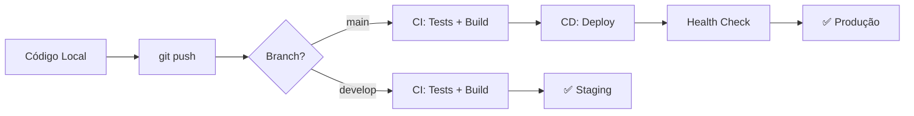

# 🚀 CI/CD Setup Guide - MAEXTRIA

Este guia explica como o sistema de CI/CD está configurado e como utilizá-lo.

---

## 📋 Índice

1. [Visão Geral](#visão-geral)
2. [Workflows Configurados](#workflows-configurados)
3. [Configuração de Secrets](#configuração-de-secrets)
4. [Como Funciona](#como-funciona)
5. [Troubleshooting](#troubleshooting)

---

## 🎯 Visão Geral

O projeto MAEXTRIA possui **3 workflows principais** no GitHub Actions:

| Workflow | Trigger | Função |
|----------|---------|--------|
| **CI** | Push/PR em main/develop | Build, testes e validações |
| **CD** | Push em main | Deploy automático para produção |
| **Security** | Push/PR/Agendado | Scans de segurança e vulnerabilidades |

---

## 📦 Workflows Configurados

### 1️⃣ CI - Continuous Integration (`.github/workflows/ci.yml`)

**Quando roda:**
- Push para `main` ou `develop`
- Pull Requests para `main` ou `develop`

**O que faz:**
- ✅ Instala dependências (backend + frontend)
- ✅ Verifica linting (ESLint)
- ✅ Compila TypeScript
- ✅ Roda testes automatizados
- ✅ Faz auditoria de segurança (`npm audit`)
- ✅ Verifica se arquivos `.env` não estão no git
- ✅ Gera artifacts de build

**Jobs:**
- `backend` - CI do backend (Node.js 18.x e 20.x)
- `frontend` - CI do frontend (Node.js 18.x e 20.x)
- `security-audit` - Auditoria de dependências
- `code-quality` - Qualidade de código
- `ci-success` - Resumo do CI

---

### 2️⃣ CD - Continuous Deployment (`.github/workflows/cd.yml`)

**Quando roda:**
- Push para `main` (automático)
- Manual via GitHub Actions UI

**O que faz:**
- 🏗️ Build de produção (backend + frontend)
- 🚀 Deploy automático para servidor
- 🏥 Health checks após deploy
- 📧 Notificações de sucesso/falha

**Jobs:**
- `build` - Compila backend e frontend
- `deploy-backend` - Deploy do backend (Railway/VPS/Vercel)
- `deploy-frontend` - Deploy do frontend (Vercel/Netlify/VPS)
- `health-check` - Verifica se os serviços estão rodando
- `notify` - Envia notificações (Slack opcional)

**Opções de Deploy Suportadas:**

| Plataforma | Backend | Frontend |
|------------|---------|----------|
| **Railway** | ✅ | ❌ |
| **Vercel** | ⚠️ Alternativa | ✅ |
| **Netlify** | ❌ | ✅ |
| **VPS (SSH)** | ✅ | ✅ |

---

### 3️⃣ Security - Security Checks (`.github/workflows/security.yml`)

**Quando roda:**
- Push para `main` ou `develop`
- Pull Requests para `main`
- Agendado: Todo domingo às 00:00 UTC
- Manual via GitHub Actions UI

**O que faz:**
- 🔍 CodeQL Analysis (análise de código)
- 🔒 Vulnerability scanning (npm audit)
- 🕵️ Secret scanning (procura por credenciais expostas)
- 📝 Verifica `.env` files no repositório
- 🛡️ OWASP Dependency Check
- 📄 License compliance check

**Jobs:**
- `codeql-analysis` - Análise estática de código
- `dependency-scan` - Scan de vulnerabilidades em dependências
- `secret-scan` - Procura por secrets expostos
- `env-check` - Verifica arquivos .env no git
- `owasp-check` - Análise OWASP
- `license-check` - Conformidade de licenças
- `security-summary` - Resumo de segurança

---

## 🔐 Configuração de Secrets

Para o CI/CD funcionar corretamente, você precisa configurar os seguintes secrets no GitHub:

### Acesse: `Settings` → `Secrets and variables` → `Actions` → `New repository secret`

### 📋 Secrets Necessários:

#### **Backend/API:**
```
JWT_SECRET=<seu-jwt-secret-forte>
OPENAI_API_KEY=<sua-chave-openai>
EMAIL_HOST=smtp.gmail.com
EMAIL_PORT=587
EMAIL_USER=<seu-email>
EMAIL_PASS=<senha-app-gmail>
```

#### **Frontend/Supabase:**
```
VITE_SUPABASE_URL=https://seu-projeto.supabase.co
VITE_SUPABASE_PUBLISHABLE_KEY=<chave-publica-supabase>
VITE_API_URL_PROD=https://api.maextria.com.br/api
```

#### **Deploy (Railway):**
```
RAILWAY_TOKEN=<seu-token-railway>
RAILWAY_PROJECT_ID=<id-do-projeto>
```

#### **Deploy (Vercel):**
```
VERCEL_TOKEN=<seu-token-vercel>
VERCEL_ORG_ID=<id-da-org>
VERCEL_PROJECT_ID=<id-do-projeto>
```

#### **Deploy (Netlify):**
```
NETLIFY_AUTH_TOKEN=<seu-token-netlify>
NETLIFY_SITE_ID=<id-do-site>
```

#### **Deploy (VPS via SSH):**
```
VPS_HOST=<ip-ou-dominio-do-servidor>
VPS_USER=<usuario-ssh>
VPS_SSH_KEY=<chave-privada-ssh>
VPS_PORT=22
```

#### **Notificações (Opcional):**
```
SLACK_WEBHOOK=<webhook-url-do-slack>
```

---

## 🔄 Como Funciona

### Fluxo Normal de Desenvolvimento:



### 1. **Desenvolvimento Local**
```bash
# Trabalhe na sua branch
git checkout -b feature/nova-funcionalidade

# Faça suas mudanças
# ... código ...

# Commit
git add .
git commit -m "feat: adiciona nova funcionalidade"

# Push
git push origin feature/nova-funcionalidade
```

### 2. **Pull Request**
- Crie um PR para `develop` ou `main`
- CI roda automaticamente
- Aguarde todos os checks passarem ✅
- Faça merge quando aprovado

### 3. **Deploy Automático**
- Merge em `main` → Deploy automático para produção
- Merge em `develop` → Deploy para staging (se configurado)

---

## 📊 Monitoramento

### Ver Status dos Workflows:

1. Acesse: `https://github.com/Derfolem/maextria2/actions`
2. Veja todos os workflows rodando/concluídos
3. Clique em um workflow para ver detalhes

### Badges para README:

Adicione badges ao seu README.md:

```markdown


```

---

## 🐛 Troubleshooting

### ❌ CI falhou no build

**Problema:** TypeScript não compila

**Solução:**
```bash
# Teste localmente:
cd backend
npm run build

cd ../frontend
npm run build
```

---

### ❌ Security check encontrou vulnerabilidades

**Problema:** `npm audit` encontrou vulnerabilidades

**Solução:**
```bash
# Tente fix automático:
npm audit fix

# Se não funcionar, veja detalhes:
npm audit

# Atualize pacotes específicos:
npm update <pacote-vulnerável>
```

---

### ❌ Deploy falhou

**Problema:** Deploy não conseguiu conectar ao servidor

**Solução:**
1. Verifique se os secrets estão configurados corretamente
2. Teste a conexão SSH manualmente:
   ```bash
   ssh usuario@seu-servidor.com
   ```
3. Verifique logs do GitHub Actions

---

### ❌ Health check falhou

**Problema:** Servidor não responde após deploy

**Solução:**
1. Verifique se o backend iniciou corretamente:
   ```bash
   ssh usuario@servidor
   pm2 logs maextria-backend
   ```
2. Verifique a porta e firewall
3. Teste manualmente:
   ```bash
   curl https://api.maextria.com.br/health
   ```

---

## 🔧 Personalização

### Modificar Workflows:

Os arquivos de workflow estão em `.github/workflows/`:

```
.github/
├── workflows/
│   ├── ci.yml          # Continuous Integration
│   ├── cd.yml          # Continuous Deployment
│   └── security.yml    # Security Checks
└── dependabot.yml      # Dependabot config
```

### Adicionar Novos Checks:

Edite `.github/workflows/ci.yml` e adicione um novo job:

```yaml
new-check:
  name: Meu Novo Check
  runs-on: ubuntu-latest
  steps:
    - uses: actions/checkout@v4
    - run: npm run meu-comando
```

---

## 📚 Recursos Adicionais

- [GitHub Actions Documentation](https://docs.github.com/en/actions)
- [Dependabot Documentation](https://docs.github.com/en/code-security/dependabot)
- [CodeQL Documentation](https://codeql.github.com/docs/)

---

## 🎉 Pronto!

Seu CI/CD está configurado e funcionando!

**Próximos passos:**
1. Configure os secrets no GitHub
2. Faça um push para `main` e veja o CI rodar
3. Monitore o deploy automático

**Dúvidas?** Abra uma issue no repositório.

---

**Criado com ❤️ para MAEXTRIA**
**Automatizado com GitHub Actions**
